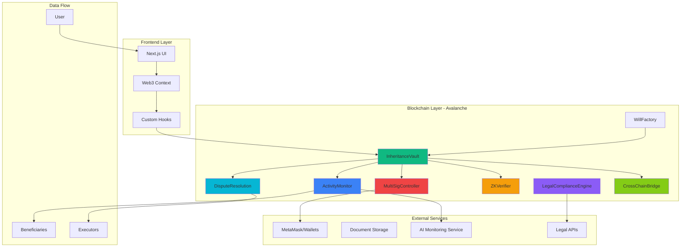

# DeFi Will - Your Legacy, Secured On-Chain

[](https://vercel.com/obiajulugifs-projects/v0-mobile-first-design)
[](https://v0.app/chat/projects/UsLHaBDvRok)
[](https://www.avax.network/)

## 🌟 Overview

DeFi Will is an AI-powered inheritance and deadman switch platform for DeFi assets built on the Avalanche blockchain. It provides a secure, automated solution for digital asset inheritance, ensuring your crypto legacy is protected and transferred to your beneficiaries when needed.

### 🚀 Key Features

- **🔐 Smart Contract Security**: Multi-signature security with automated inheritance triggers
- **🤖 AI Activity Monitoring**: Intelligent behavioral analysis to detect user activity
- **⚖️ Legal Compliance**: Multi-jurisdictional legal framework integration
- **🔒 Privacy Protection**: Zero-knowledge proofs for sensitive data
- **🌐 Cross-Chain Support**: Seamless asset management across multiple blockchains
- **📱 Mobile-First Design**: Responsive interface optimized for all devices
- **⏰ Deadman Switch**: Automated notifications and inheritance triggers
- **📄 Document Management**: Secure document upload and storage for wills

## 🏗️ System Architecture

### Visual Architecture Diagram



### System Design Overview

DeFi Will implements a sophisticated multi-layered architecture designed for security, scalability, and legal compliance:

#### 1. **Frontend Architecture**
- **Next.js 14**: Server-side rendering with App Router for optimal performance
- **Web3 Integration**: Custom hooks and context providers for blockchain interaction
- **State Management**: React Context API with optimistic updates
- **UI Components**: shadcn/ui with Tailwind CSS for consistent design
- **Mobile-First**: Responsive design optimized for mobile devices

#### 2. **Smart Contract Architecture**

##### Core Contracts:

**InheritanceVault** (Main Contract)
- Asset storage and management
- Beneficiary allocation logic
- Inheritance trigger mechanisms
- Integration with all other contracts

**ActivityMonitor** 
- Tracks user blockchain activity
- Implements deadman switch logic
- Manages 30-day activity windows
- Triggers inheritance events

**LegalComplianceEngine**
- Multi-jurisdictional compliance
- Legal document validation
- Regulatory requirement enforcement
- Audit trail maintenance

**MultiSigController**
- Multi-signature security layer
- Authorized executor management
- Transaction approval workflows
- Emergency override mechanisms

**ZKVerifier**
- Zero-knowledge proof verification
- Privacy-preserving identity checks
- Confidential beneficiary data
- Secure document hashing

**DisputeResolution**
- Inheritance dispute handling
- Arbitration mechanisms
- Evidence submission system
- Resolution enforcement

**CrossChainBridge**
- Multi-blockchain asset support
- Cross-chain transfer protocols
- Asset synchronization
- Bridge security mechanisms

#### 3. **Data Flow Architecture**

```
User Action → Frontend Validation → Web3 Provider → Smart Contract → Blockchain
     ↓                                                                    ↓
Event Emission ← State Update ← Transaction Receipt ← Block Confirmation
     ↓
UI Update → Notification System → Beneficiary Alerts
```

#### 4. **Security Architecture**

**Multi-Layer Security Model:**
1. **Frontend Security**: Input validation, XSS protection, CSRF tokens
2. **Web3 Security**: Wallet signature verification, transaction validation
3. **Smart Contract Security**: Reentrancy guards, access controls, pausable contracts
4. **Blockchain Security**: Avalanche consensus, cryptographic proofs
5. **Privacy Security**: Zero-knowledge proofs, encrypted storage

**Security Features:**
- Multi-signature requirements for critical operations
- Time-locked transactions for inheritance triggers
- Emergency pause mechanisms
- Audit trails for all operations
- Encrypted document storage with IPFS

#### 5. **AI Integration Architecture**

**Behavioral Analysis Engine:**
- On-chain activity pattern recognition
- Machine learning models for user behavior
- Anomaly detection for security threats
- Predictive analytics for inheritance timing

**Activity Monitoring System:**
- Real-time blockchain event monitoring
- Multi-dimensional activity scoring
- Customizable activity thresholds
- Automated notification triggers

## 🛠️ Tech Stack

- **Frontend**: Next.js 14, React, TypeScript
- **Styling**: Tailwind CSS v4, shadcn/ui components
- **Blockchain**: Avalanche, Ethers.js, Smart Contracts (Solidity)
- **Authentication**: Web3 wallet integration (MetaMask, WalletConnect)
- **Storage**: IPFS for documents, Vercel Blob for assets
- **AI/ML**: Custom behavioral analysis algorithms
- **Fonts**: Montserrat (headings), Open Sans (body)
- **Deployment**: Vercel with automatic Git sync

## 📁 Project Structure

```
├── app/
│   ├── page.tsx                 # Landing page with hero, features, testimonials
│   ├── dashboard/               # User dashboard with portfolio, wills, activity
│   ├── create-will/             # 5-step will creation wizard
│   ├── beneficiaries/           # Beneficiary management interface
│   ├── architecture/            # Interactive smart contract architecture
│   └── auth/                    # Web3 authentication pages
├── components/
│   ├── ui/                      # shadcn/ui base components
│   ├── header.tsx               # Navigation with wallet connection
│   ├── hero-section.tsx         # Landing page hero with animations
│   ├── dashboard-*.tsx          # Dashboard components (stats, portfolio, etc.)
│   ├── create-will-flow.tsx     # Multi-step will creation wizard
│   ├── deadman-switch-*.tsx     # Activity monitoring components
│   └── smart-contract-*.tsx     # Blockchain interaction components
├── contracts/
│   ├── DefiWill.sol            # Main inheritance contract
│   ├── WillFactory.sol         # Contract factory for will creation
│   ├── ActivityMonitor.sol     # Activity tracking contract
│   └── scripts/                # Hardhat deployment scripts
├── contexts/
│   └── web3-provider.tsx       # Web3 context with wallet management
├── hooks/
│   ├── use-web3.ts             # Web3 integration and wallet hooks
│   └── use-defi-will.ts        # Smart contract interaction hooks
└── lib/
    ├── web3-config.ts          # Avalanche network configuration
    └── utils.ts                # Utility functions and helpers
```

## 🎯 Core Functionality

### 1. **Digital Will Creation**
- **5-Step Wizard**: Basic info → Assets → Beneficiaries → Documents → Review
- **Asset Management**: AVAX, ERC-20 tokens, NFTs, cross-chain assets
- **Beneficiary Allocation**: Percentage-based distribution with conditions
- **Document Upload**: Secure IPFS storage with encryption
- **Smart Contract Deployment**: Automated contract creation and configuration

### 2. **Activity Monitoring & Deadman Switch**
- **30-Day Activity Cycle**: Configurable monitoring periods
- **Multi-Signal Detection**: Transaction activity, wallet connections, manual confirmations
- **Progressive Notifications**: 7-day, 3-day, 1-day warnings to beneficiaries
- **AI Behavioral Analysis**: Pattern recognition for genuine activity vs. automated actions
- **Emergency Override**: Multi-sig emergency stops and manual interventions

### 3. **Inheritance Management**
- **Automated Distribution**: Smart contract-based asset transfers
- **Legal Compliance**: Jurisdiction-specific requirement validation
- **Dispute Resolution**: Built-in arbitration and evidence submission
- **Cross-Chain Support**: Seamless inheritance across multiple blockchains
- **Privacy Protection**: Zero-knowledge proofs for sensitive information

### 4. **Dashboard & Management**
- **Real-Time Portfolio**: Live asset values and allocation tracking
- **Will Status Monitoring**: Active wills, beneficiaries, and conditions
- **Activity Feed**: Comprehensive transaction and event history
- **Security Center**: Multi-sig status, security recommendations
- **Notification System**: Real-time alerts and beneficiary communications

## 🔗 Smart Contract Interactions

### Contract Deployment Flow
```
WillFactory.createWill() → InheritanceVault.initialize() → ActivityMonitor.setup()
                                    ↓
MultiSigController.configure() → ZKVerifier.setupProofs() → LegalComplianceEngine.validate()
```

### Inheritance Trigger Flow
```
ActivityMonitor.checkActivity() → 30 days inactive → triggerInheritance()
                                        ↓
LegalComplianceEngine.validate() → MultiSigController.approve() → InheritanceVault.distribute()
                                        ↓
CrossChainBridge.transfer() → Beneficiaries receive assets → Event emissions
```

## 🚀 Getting Started

### Prerequisites
- Node.js 18+ 
- MetaMask or compatible Web3 wallet
- Avalanche network access (Mainnet/Fuji Testnet)
- Git for version control

### Installation

1. Clone the repository:
```bash
git clone https://github.com/your-username/defi-will.git
cd defi-will
```

2. Install dependencies:
```bash
npm install
```

3. Set up environment variables:
```bash
cp .env.example .env.local
```

Add your environment variables:
```env
# Smart Contract Addresses
NEXT_PUBLIC_WILL_FACTORY_ADDRESS=your_factory_contract_address
NEXT_PUBLIC_DEFI_WILL_TEMPLATE_ADDRESS=your_template_address

# Web3 Configuration
NEXT_PUBLIC_WALLETCONNECT_PROJECT_ID=your_walletconnect_project_id

# Deployment Keys (for contract deployment)
PRIVATE_KEY=your_deployment_private_key
SNOWTRACE_API_KEY=your_snowtrace_api_key
```

4. Deploy smart contracts (optional):
```bash
cd contracts
npm install
npx hardhat run scripts/deploy.js --network fuji
```

5. Run the development server:
```bash
npm run dev
```

6. Open [http://localhost:3000](http://localhost:3000) in your browser.

### Network Configuration

The application supports both Avalanche Mainnet and Fuji Testnet:

**Avalanche Mainnet:**
- Chain ID: 43114
- RPC URL: https://api.avax.network/ext/bc/C/rpc
- Explorer: https://snowtrace.io

**Fuji Testnet:**
- Chain ID: 43113
- RPC URL: https://api.avax-test.network/ext/bc/C/rpc
- Explorer: https://testnet.snowtrace.io

## 🌐 Deployment

The application is deployed on Vercel with automatic Git synchronization:

**Live Demo**: [https://vercel.com/obiajulugifs-projects/v0-mobile-first-design](https://vercel.com/obiajulugifs-projects/v0-mobile-first-design)

### Deployment Features:
- Automatic deployments on Git push
- Environment variable management
- Edge function optimization
- Global CDN distribution
- SSL certificate management

## 🤝 Contributing

This project was built using [v0.app](https://v0.app) for rapid development and deployment.

To continue development:
1. Visit [https://v0.app/chat/projects/UsLHaBDvRok](https://v0.app/chat/projects/UsLHaBDvRok)
2. Make changes using the v0 interface
3. Deploy changes directly from v0
4. Changes automatically sync to this repository

### Development Workflow:
1. **Design**: Use v0.app for UI/UX development
2. **Smart Contracts**: Develop and test using Hardhat
3. **Integration**: Connect frontend with blockchain using custom hooks
4. **Testing**: Comprehensive testing on Fuji testnet
5. **Deployment**: Automatic deployment via Vercel

## 📄 License

This project is licensed under the MIT License - see the [LICENSE](LICENSE) file for details.

## 🔒 Security & Auditing

DeFi Will prioritizes security with multiple layers of protection:

### Security Measures:
- **Smart Contract Auditing**: Professional security audits
- **Multi-Signature Security**: Required for critical operations
- **Time-Lock Mechanisms**: Delayed execution for sensitive functions
- **Emergency Pause**: Circuit breakers for emergency situations
- **Access Controls**: Role-based permissions and restrictions
- **Reentrancy Protection**: Guards against common attack vectors
- **Input Validation**: Comprehensive frontend and contract validation
- **Encrypted Storage**: Zero-knowledge proofs for sensitive data

### Audit Trail:
- All transactions recorded on-chain
- Event emissions for state changes
- Comprehensive logging system
- Beneficiary notification system
- Legal compliance documentation

## 📞 Support & Documentation

For support and questions:
- **Issues**: Create an issue in this repository
- **Documentation**: Visit our [v0.app project](https://v0.app/chat/projects/UsLHaBDvRok)
- **Smart Contracts**: View on [Snowtrace](https://snowtrace.io)
- **Community**: Join our development discussions

### Resources:
- [Avalanche Documentation](https://docs.avax.network/)
- [Next.js Documentation](https://nextjs.org/docs)
- [Ethers.js Documentation](https://docs.ethers.org/)
- [Tailwind CSS Documentation](https://tailwindcss.com/docs)

---

**Built with ❤️ using [v0.app](https://v0.app) and deployed on [Vercel](https://vercel.com)**

*Securing digital legacies on the Avalanche blockchain - because your crypto deserves a proper inheritance plan.*
